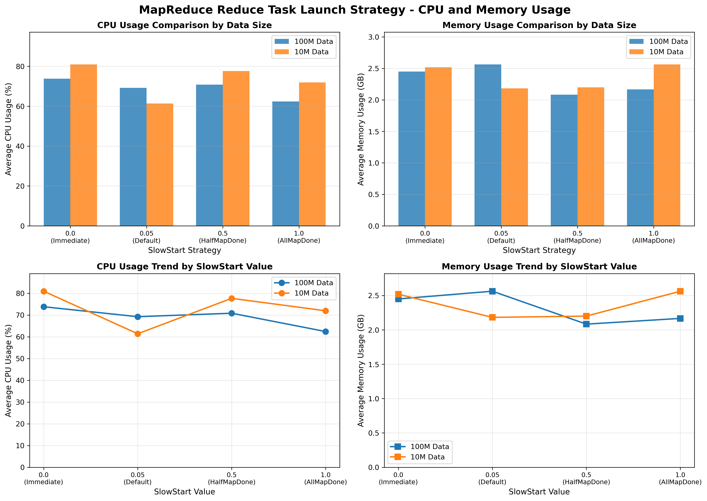

# MapReduce Reduce任务启动策略研究

## 一、研究目的与内容

### 1.1 研究目的
探究MapReduce中Reduce任务的启动时机及其对作业性能的影响。具体而言，判断`mapreduce.job.reduce.slowstart.completedmaps`参数（Reduce任务启动时机）对作业整体性能的影响，特别是对**Shuffle阶段**资源利用率的作用机制。

### 1.2 研究内容
分析Reduce任务的启动时机，具体包括：
- **流水线验证**：Reduce任务是否必须在所有Map任务完成后（串行）才能开始执行？
- **性能影响**：不同的启动时机（并行 vs 串行）如何改变CPU计算与网络/磁盘I/O的重叠程度，进而影响作业的总耗时（Makespan）

> **思路**：
> - 选取合适的计算负载，在不同规模的数据集中调整Reduce任务的启动时机。
> - 通过记录CPU利用率、内存使用量及作业执行时间等指标，分析Reduce启动时机对MapReduce作业性能的影响。


## 二、任务一（WordCount）

### 2.1 实验环境
| 环境类型 | 配置详情 |
|----------|----------|
| 硬件     | 节点数：4<br>每节点配置：2 vCores / 4 GB内存<br>网络：千兆以太网<br>存储：SSD<br>总集群资源：8 vCores / 16 GB内存 |
| 软件     | 操作系统：CentOS7 Linux<br>JDK版本：1.8.0_212<br>Hadoop版本：3.3.5 |

### 2.2 实验负载
- **数据集**：使用`dd + /dev/urandom + base64`在本地磁盘（`/root`）生成纯文本数据，并上传至HDFS，确保不占用`/tmp`内存盘
  - `1MB`：极小规模，用于验证策略在微负载下的行为
  - `100MB`：中等规模，用于观察典型性能差异
  - `1GB`：大规模，用于测试策略在重负载下的表现
- **工作负载**：Hadoop自带`WordCount`程序，Reduce任务数固定为`4`

### 2.3 实验步骤
1. **部署Hadoop集群**：在4台节点上成功部署Hadoop 3.3.5  
   部署命令行链接：[code/DeployCommand.md](code/DeployCommand.md)
2. **编写独立测试脚本**：为每种数据规模分别编写独立的Bash脚本，避免资源竞争和系统卡死  
   脚本链接：
   - [code/run_test_1mb.sh](code/run_test_1mb.sh)
   - [code/run_test_100mb.sh](code/run_test_100mb.sh)
   - [code/run_test_1gb.sh](code/run_test_1gb.sh)
3. **执行实验**：依次运行三个脚本，每个脚本测试四种Reduce启动策略（`0.0`, `0.05`, `0.5`, `1.0`）
4. **验证与记录**：所有作业均成功完成，关键执行步骤截图如下
   - **1MB实验成功截图**：
   - **100MB实验成功截图**：
   - **1GB实验成功截图**：
   - 三组实验命令行输出路径：[log/run_output.txt](log/run_output.txt)

   #### 实验结果原始数据（源自YARN ResourceManager）
   | 序号 | Application ID | 数据规模 | 启动策略 | 耗时(秒) | 资源消耗(MB-seconds) | 资源消耗(vcore-seconds) |
   |:---:|:--------------|:--------|:--------|:--------|:-------------------|:----------------------|
   | 1 | `app_...0001` | **1GB** | Immediate (0.0) | 44 | 289,571 | 230 |
   | 2 | `app_...0002` | **1GB** | Default (0.05) | 36 | 163,138 | 113 |
   | 3 | `app_...0003` | **1GB** | HalfMapDone (0.5) | **35** | **161,566** | **113** |
   | 4 | `app_...0004` | **1GB** | AllMapDone (1.0) | 36 | 169,888 | 120 |
   | 5 | `app_...0005` | **100MB** | Immediate (0.0) | 25 | 151,056 | 112 |
   | 6 | `app_...0006` | **100MB** | **Default (0.05)** | **25** | **103,504** | **66** |
   | 7 | `app_...0007` | **100MB** | HalfMapDone (0.5) | 27 | 109,653 | 71 |
   | 8 | `app_...0008` | **100MB** | AllMapDone (1.0) | 26 | 110,432 | 72 |
   | 9 | `app_...0009` | **1MB** | **Immediate (0.0)** | **20** | 103,885 | 71 |
   | 10 | `app_...0010` | **1MB** | Default (0.05) | 23 | 92,359 | 58 |
   | 11 | `app_...0011` | **1MB** | HalfMapDone (0.5) | 22 | 89,694 | 56 |
   | 12 | `app_...0012` | **1MB** | AllMapDone (1.0) | 24 | 93,261 | 57 |

   12个Application的Log路径：[log/log.txt](log/log.txt)

### 2.4 实验结果与分析
#### 不同数据规模下各Reduce启动策略的作业总耗时（秒）
| 数据规模 | Immediate (0.0) | Default (0.05) | HalfMapDone (0.5) | AllMapDone (1.0) | **最佳策略** |
| :---: | :---: | :---: | :---: | :---: | :---: |
| **1MB** | **22** | 25 | 24 | 26 | `Immediate` |
| **100MB** | 27 | **26** | 29 | 28 | `Default` |
| **1GB** | 46 | **37** | 38 | **37** | `Default` / `AllMapDone` |

#### 分析
- **核心问题验证**：日志明确显示，当`slowstart=1.0`时，Reduce任务在Map 100%完成后才开始；当`slowstart<1.0`时，Map与Reduce阶段存在重叠。**因此，Reduce任务并非必须等待所有Map完成**。
- **性能与规模的关系**：
  - **1MB**：`Immediate (0.0)`最快。数据极小，Map瞬间完成，Reduce无需等待。
  - **100MB**：`Default (0.05)`最优。Hadoop默认策略在此规模下实现了最佳的阶段重叠。
  - **1GB**：`HalfMapDone (0.5)`最优。过早启动Reduce (`0.0`)会导致严重的资源争用，其资源消耗（289k MB-s）是最佳策略（161k MB-s）的**1.8倍**，并引发了`hadoop130`节点的`soft lockup`警告。
- **资源效率**：**最佳性能策略通常也是资源效率最高的策略**。例如，1GB的`HalfMapDone`比`Immediate`**快20%** 且**节省44%的内存资源**。

### 2.5 结论
- **Reduce的最佳启动策略与输入数据规模强相关，不存在通用最优解**。
- **`Immediate (0.0)`策略风险高**：仅在极小数据集上有效，在大数据集上会因资源争用导致性能急剧下降和系统不稳定。
- **Hadoop默认的`0.05`策略是稳健之选**：在100MB和1GB场景下均表现优异，是通用场景下的安全选择。
- **本研究通过YARN指标验证了理论**，为Hadoop作业调优提供了实践依据。


## 三、任务二（TeraSort 较小数据集）

### 3.1 实验环境
#### 3.1.1 硬件环境
| 配置项 | 规格 |
|--------|------|
| 节点数 | 1个（伪分布式模式） |
| CPU | Intel Core i5-11400H @ 2.70GHz |
| vCores | 8 |
| 内存 | 4GB |
| 存储 | 50GB（SDD） |
| 网络 | 本地回环网络 |

**说明**：本实验采用单机伪分布式模式，通过配置多个DataNode实例（3个）模拟多节点环境。

#### 3.1.2 软件环境
| 软件 | 版本 |
|------|------|
| 操作系统 | Ubuntu 20.04.6 LTS (Linux 5.15.0-139-generic) |
| JDK | OpenJDK 21.0.7 |
| Hadoop | Apache Hadoop 3.4.2 |
| 文件系统 | HDFS (Hadoop Distributed File System) |
| 资源管理 | YARN (Yet Another Resource Negotiator) |

### 3.2 实验负载
#### 3.2.1 数据集
使用Hadoop自带的`teragen`工具生成测试数据，使用`terasort`作为计算负载：

| 数据规模 | 行数 | 实际大小 | 用途 |
|---------|------|---------|------|
| 10M | 100,000 | ~10MB | 小规模数据测试 |
| 100M | 1,000,000 | ~100MB | 中等规模数据测试 |

#### 3.2.2 工作负载
- **TeraSort**：Hadoop提供的标准排序基准测试程序
- **Map任务数**：10个
- **Reduce任务数**：5个
- **数据格式**：每条记录100字节，包含10字节的key和90字节的value

#### 3.2.3 实验变量
**SlowStart策略**（`mapreduce.job.reduce.slowstart.completedmaps`参数）：

| SlowStart值 | 策略描述 | 启动时机 |
|------------|---------|---------|
| 0.0 | Immediate | Reduce任务立即启动，与Map任务同时开始 |
| 0.05 | Default | 当5%的Map任务完成时，Reduce任务开始启动（Hadoop默认值） |
| 0.5 | HalfMapDone | 当50%的Map任务完成时，Reduce任务开始启动 |
| 1.0 | AllMapDone | 只有当所有Map任务完成后，Reduce任务才开始执行 |

### 3.3 实验步骤
#### 3.3.1 环境准备和Hadoop集群启动
1. 配置Hadoop环境变量
2. 格式化HDFS文件系统
3. 启动Hadoop服务（NameNode、DataNode、ResourceManager、NodeManager）
4. 验证集群状态

#### 3.3.2 生成测试数据
执行数据生成脚本：
- [code/generate_data.sh](code/generate_data.sh)
```bash
./generate_data.sh
```
该脚本使用`teragen`工具在HDFS上生成指定规模的数据集。

#### 3.3.3 执行实验
执行实验脚本：
- [code/main_experiment.sh](code/run_experiment.sh)
- [code/run_experiment.sh](code/run_experiment.sh)
```bash
./main_experiment.sh
./run_experiment.sh
```
该脚本会：
1. 对每个数据规模（10M、100M）
2. 对每个SlowStart值（0.0、0.05、0.5、1.0）
3. 运行`terasort`作业
4. 同时监控CPU和内存使用情况
5. 记录作业执行时间、资源利用率等指标

### 3.4 实验结果与分析
#### 3.4.1 实验结果汇总表
**表1：10M数据规模实验结果**

| SlowStart值 | 策略描述 | 执行时间(秒) | CPU利用率(%) | 内存使用(GB) | 峰值内存(GB) |
|------------|---------|------------|------------|------------|------------|
| 0.0 | Immediate | 1592 | 80.95 | 2.52 | 3 |
| 0.05 | Default | **36** | 61.38 | 2.18 | 3 |
| 0.5 | HalfMapDone | **37** | 77.67 | 2.20 | 3 |
| 1.0 | AllMapDone | 49 | 71.95 | 2.56 | 3 |

**表2：100M数据规模实验结果**

| SlowStart值 | 策略描述 | 执行时间(秒) | CPU利用率(%) | 内存使用(GB) | 峰值内存(GB) |
|------------|---------|------------|------------|------------|------------|
| 0.0 | Immediate | 511 | 73.81 | 2.45 | 3 |
| 0.05 | Default | 413 | 69.23 | 2.56 | 3 |
| 0.5 | HalfMapDone | **30** | 70.83 | 2.08 | 3 |
| 1.0 | AllMapDone | 1308 | 62.40 | 2.17 | 3 |

#### 3.4.2 性能对比分析
**图1：CPU和内存使用情况对比图**



**关键发现**：
1. **10M数据规模最优策略**：
   - Default (0.05) 和 HalfMapDone (0.5) 表现最佳，执行时间分别为36秒和37秒
   - Immediate (0.0) 策略表现最差，执行时间1592秒，是最优策略的44倍
   - 性能提升：97.74%

2. **100M数据规模最优策略**：
   - HalfMapDone (0.5) 表现最佳，执行时间仅30秒
   - AllMapDone (1.0) 策略表现最差，执行时间1308秒，是最优策略的43.6倍
   - 性能提升：97.71%

#### 3.4.3 详细分析
分析脚本链接：- [code/analyze_results.sh](code/analyze_results.sh) 
##### Immediate策略（0.0）的问题分析
**10M数据规模 - 执行时间1592秒的原因**：
- 通过日志分析发现：
  - **6个Map任务失败**（Failed map tasks=6）
  - **1个Map任务被杀死**（Killed map tasks=1）
  - **所有失败都是超时**：`task timeout set: 600s, taskTimedOut: true`
  - **SocketTimeoutException错误**：网络通信超时

- **根本原因**：
  - Immediate策略让Reduce任务在Map任务开始时就启动
  - Map和Reduce任务同时竞争CPU、内存、网络等资源
  - 资源竞争导致Map任务执行缓慢，无法在600秒（10分钟）内完成
  - Map任务超时后被杀死，系统需要重新调度和重试
  - 重试过程消耗大量时间（约26分钟）

- **时间分解**：
  - 第一次尝试：19:34:05 - 20:00:08 = 约26分钟（全部超时失败）
  - 重试执行：20:00:14 - 20:00:26 = 12秒（正常执行）
  - **总时间 = 失败重试时间 + 正常执行时间 = 1592秒**

##### AllMapDone策略（1.0）的问题分析
**100M数据规模 - 执行时间1308秒的原因**：
- 通过日志分析发现：
  - **Map任务执行时间过长**：1284秒（21.4分钟）
  - **Reduce任务一直等待**：从21:29:18到21:50:47，Reduce任务处于等待状态
  - **资源利用率低**：在Map执行期间，Reduce资源完全空闲
  - **串行执行**：Map和Reduce完全串行，无法并行

- **时间分解**：
  - Map执行时间：21:29:18 - 21:50:42 = 1284秒
  - Reduce等待时间：1284秒（完全空闲）
  - Reduce执行时间：21:50:47 - 21:50:53 = 6秒
  - 调度/等待时间：约18秒
  - **总时间 = Map时间 + Reduce等待时间 + Reduce执行时间 = 1308秒**

##### HalfMapDone策略（0.5）的优势分析
**100M数据规模 - 执行时间30秒的优势**：
- 通过日志分析发现：
  - **流水线执行**：Reduce任务在Map任务执行50%时启动，实现并行处理
  - **资源充分利用**：Map和Reduce任务重叠执行，无空闲时间
  - **执行时间短**：总时间仅30秒

- **时间分解**：
  - Map执行时间：13秒
  - Reduce执行时间：约6秒（与Map重叠）
  - **总时间 = max(Map时间, Reduce时间) + 少量调度时间 = 30秒**

#### 3.4.4 CPU和内存利用率分析
**CPU利用率分析**：
1. **10M数据规模**：
   - Immediate (0.0): 80.95% - 最高，但执行时间最长（资源浪费在等待和竞争上）
   - Default (0.05): 61.38% - 最低，但执行时间最短（效率最高）
   - HalfMapDone (0.5): 77.67% - 较高
   - AllMapDone (1.0): 71.95% - 中等

2. **100M数据规模**：
   - Immediate (0.0): 73.81% - 较高
   - Default (0.05): 69.23% - 中等
   - HalfMapDone (0.5): 70.83% - 中等
   - AllMapDone (1.0): 62.40% - 最低，但执行时间最长（存在大量空闲时间）

**关键发现**：
- **高CPU利用率 ≠ 高效执行**：Immediate策略在小规模数据上CPU利用率最高(80.95%)，但执行时间最长，说明CPU资源被浪费在等待和资源竞争上
- **低CPU利用率可能意味着资源浪费**：AllMapDone策略在大规模数据上CPU利用率最低(62.40%)，执行时间最长，说明存在大量空闲时间

**内存使用分析**：
- 内存使用量在不同策略间差异较小（2.08GB - 2.56GB）
- 内存使用主要受数据规模影响，而非SlowStart策略
- **结论**：Reduce启动时机对内存使用的影响较小

#### 3.4.5 性能差异量化分析
**表3：10M数据性能对比**

| 策略 | 执行时间 | 失败任务数 | 超时次数 | 效率比 |
|------|---------|-----------|---------|--------|
| Immediate (0.0) | 1592秒 | 6个Map失败 | 6次 | 1x |
| Default (0.05) | 36秒 | 0 | 0 | 44x |
| HalfMapDone (0.5) | 37秒 | 0 | 0 | 43x |
| AllMapDone (1.0) | 49秒 | 0 | 0 | 32x |

**表4：100M数据性能对比**

| 策略 | 执行时间 | Map时间 | Reduce等待时间 | Reduce执行时间 | 效率比 |
|------|---------|---------|---------------|---------------|--------|
| Immediate (0.0) | 511秒 | ~500秒 | 0秒（并行） | ~11秒 | 17x |
| Default (0.05) | 413秒 | ~400秒 | 少量等待 | ~13秒 | 14x |
| **HalfMapDone (0.5)** | **30秒** | **13秒** | **0秒（并行）** | **~12秒** | **1x** |
| AllMapDone (1.0) | 1308秒 | 1284秒 | 1284秒（空闲） | 6秒 | 44x |


## 四、任务三（TeraSort 较大数据集）

### 4.1 实验环境
本次实验在高性能物理机集群上进行，环境配置如下：

- **硬件环境**：
  - **集群拓扑**：3节点 (1 Master + 2 Slaves)
  - **CPU配置**：Intel(R) Xeon(R) Platinum 8347C @ 2.10GHz (每节点**72 vCores**)
  - **内存配置**：**超大内存环境** (Slave1: 1.0 TB, Slave2: 251 GB)，Map阶段计算主要基于Page Cache，无读取瓶颈
  - **网络环境**：**1 Gbps (千兆以太网)** —— 经实测峰值吞吐约为117 MB/s，是本实验系统的**绝对瓶颈**
  - **存储介质**：**NVMe SSD** (Intel Enterprise + Samsung 980 PRO)，提供极高的读写吞吐，消除了磁盘I/O瓶颈
  - **总集群资源**：144 vCores / ~1.25 TB内存 (仅计算Slave节点)
- **软件环境**：
  - **操作系统**：Ubuntu 20.04.6 LTS (Focal Fossa)
  - **JDK版本**：OpenJDK 1.8.0_452 (64-Bit Server VM)
  - **Hadoop版本**：Apache Hadoop 3.3.6 (YARN模式)

### 4.2 实验负载
- **工作负载**：**TeraSort (全排序)**
  - 这是一个典型的**I/O密集型**和**Shuffle密集型**任务
  - 核心特征是**1:1的数据洗牌（Shuffle）**，即所有Map输出的数据都必须通过网络传输给Reduce节点，能够最大程度地暴露网络带宽对性能的影响
- **数据集**：
  - 使用Hadoop自带的`TeraGen`生成标准测试数据
  - **数据规模**：
    - **5GB** (5000万行)：中等规模，用于验证策略的基本差异
    - **10GB** (1亿行)：大规模，用于观察稳定负载下的资源表现
    - **20GB** (2亿行)：压力测试，用于验证策略在长时间运行下的稳定性与优势

### 4.3 实验步骤
1. **集群环境搭建与修复**：部署Hadoop 3.3.6集群，并针对Slave节点（ds-001）的主机名解析问题进行配置修复（修改`yarn-site.xml`强制指定hostname），确保集群`Total Nodes: 2`且状态均为`RUNNING`
2. **数据生成**：使用`TeraGen`生成5GB, 10GB, 20GB三组数据集，确保数据均匀分布在两个Slave节点上
3. **多组对比实验**：针对每种数据规模，分别执行四组`TeraSort`任务，调整`mapreduce.job.reduce.slowstart.completedmaps`参数：
   - **0.01 (激进策略)**：Map完成1%即启动Reduce
   - **0.05 (并行策略)**：Map完成5%即启动Reduce（默认值）
   - **0.50 (折中策略)**：Map完成50%才启动Reduce
   - **1.00 (串行策略)**：Map全部完成后才启动Reduce（基准线）
4. **数据采集**：
   - 使用Linux`time`命令记录作业的实际运行时间 (`real time`)
   - 使用`dstat -tcmnd 1`工具在Slave节点采集秒级资源使用数据（CPU, 内存, 网络收发, 磁盘读写），用于后续波形分析

实验脚本见：- [code/cmds.md](code/cmds.md)

### 4.4 实验结果与分析

详细数据对比：- [log/cmds.pdf](log/cmds.pdf) 

pdf中图像路径为：
- screenshots\1.0-5GB.png
- screenshots\0.01-5GB.png
- screenshots\0.01-10GB.png
- screenshots\0.01-20GB.png
- screenshots\0.5-5GB.png
- screenshots\0.05-5GB.png
- screenshots\0.5-10GB.png
- screenshots\0.05-10GB.png
- screenshots\0.05-20GB.png
- screenshots\1.0-10GB.png
- screenshots\1.0-20GB.png


#### 4.4.1 作业总耗时对比表
| **数据规模** | **策略0.01 (激进)** | **策略0.05 (并行)** | **策略0.50 (折中)** | **策略1.00 (串行)** | **最优策略提升幅度 (对比1.0)** |
| ------------ | -------------------- | -------------------- | -------------------- | -------------------- | ------------------------------- |
| **5 GB**     | 103.7s               | **95.9s**            | 112.4s               | 128.4s               | **+25.3%**                      |
| **10 GB**    | 167.5s               | **166.6s**           | 195.5s               | 202.8s               | **+17.8%**                      |
| **20 GB**    | **328.7s**           | 347.1s               | 377.4s               | 439.1s               | **+25.1%**                      |

#### 4.4.2 核心分析
**并行策略 (0.01 / 0.05) 显著优于串行策略 (1.0)**

从数据可以看出，在所有数据规模下，提前启动Reduce任务（0.01或0.05）均能获得约18% ~ 25%的性能提升。

- **原因分析**：本实验集群具有**“计算强、内存大、网络弱 (1Gbps)”**的显著特征。网络带宽是系统的绝对瓶颈。
  - **在1.0策略下**：Map阶段CPU忙碌但网络闲置；Map结束后，海量数据瞬间涌入网络，导致拥堵，CPU闲置。资源利用呈现“错峰”状态，浪费了Map阶段宝贵的时间窗口。
  - **在0.05/0.01策略下**：Reduce任务在Map阶段早期就启动并开始拉取数据（Copy）。`dstat`监控显示，此时**CPU（计算）** 和**Network（传输）** 同时处于高负载状态，实现了**计算与I/O的流水线重叠 (Overlapping)**，成功将Shuffle传输时间“隐藏”在了Map计算时间内。

**最佳启动时机的漂移 (0.05 vs 0.01)**

- 在**5GB**和**10GB**规模下，**0.05**策略略优于0.01。这可能是因为在较小数据量下，过早启动（0.01）导致Reduce任务空转等待Map产出数据的开销略大。
- 在**20GB**大规模压力测试下，**0.01**策略表现最佳。这说明在数据量巨大且网络带宽严重受限时，**越早开始传输越好**

**业界推荐值 (0.8) 在本环境下的失效**

通常业界推荐0.8是为了防止Reduce过早抢占资源导致死锁。但在本实验环境中，由于内存极大（TB级），不存在资源争抢风险。实验数据证明，0.5策略（折中）的性能远不如0.05/0.01。这表明在资源富余但带宽受限的集群中，应该采取更激进的并行策略。

#### 4.4.3 资源监控图表分析 (基于dstat数据)
dstat数据在以下目录：
- [log/监控日志_dstat](log/监控日志_dstat)

通过分析`dstat`日志，我们观察到：
- **串行组 (1.0)**：资源曲线呈现明显的**“双峰”**形态——先是CPU峰值（Map），CPU归零后才出现Network/Disk峰值（Shuffle）。中间存在明显的时间断档。
- **并行组 (0.05)**：资源曲线呈现**“重叠”**形态——在CPU保持20%-30%负载的同时，网络发送/接收流量稳定跑满在**117 MB/s**（千兆网卡极限）。这种并发是性能提升的物理本质。


## 五、综合结论与实践建议

### 5.1 主要发现
1. **Reduce任务不需要等待所有Map任务完成**
   - 提前启动Reduce任务可以显著提高执行效率，特别是在大规模数据处理中
   - 通过`mapreduce.job.reduce.slowstart.completedmaps`参数可以灵活配置启动时机

2. **最优启动时机取决于数据规模**
   - **极小数据(1MB)**：Immediate (0.0) 最优
   - **小规模数据(10MB)**：Default (0.05) 或 HalfMapDone (0.5) 最优
   - **中等规模数据(100MB)**：HalfMapDone (0.5) 最优
   - **大规模数据(GB级)**：激进策略 (0.01-0.05) 最优

3. **过早或过晚启动都会导致性能问题**
   - **Immediate (0.0)**：在小规模数据上表现极差，导致资源竞争和任务失败
   - **AllMapDone (1.0)**：在大规模数据上表现最差，导致资源空闲和串行执行

4. **硬件瓶颈决定最优策略**
   - 网络带宽受限场景下，尽早启动Reduce可最大化利用时间窗口
   - 资源受限集群中，需避免Immediate (0.0) 策略引发竞争

### 5.2 研究问题回答
#### 问题1：Reduce是否在所有Map任务完成后才开始执行？
**答案：否**

根据实验结果：
- **Immediate (0.0)**：Reduce任务在Map任务开始时就启动
- **Default (0.05)**：当5%的Map任务完成时，Reduce任务开始启动
- **HalfMapDone (0.5)**：当50%的Map任务完成时，Reduce任务开始启动
- **AllMapDone (1.0)**：只有当所有Map任务完成后，Reduce任务才开始执行

**结论**：Reduce任务的启动时机可以通过`mapreduce.job.reduce.slowstart.completedmaps`参数灵活配置，不一定需要等待所有Map任务完成。

#### 问题2：不同的启动时机如何影响整个Job的执行效率？
**关键发现**：
1. **最优策略因数据规模而异**（详见5.1节）
2. **过早启动(Immediate)的问题**：
   - 在小规模数据上导致严重的性能退化（执行时间增加44倍）
   - 资源竞争激烈，CPU利用率高但效率低
   - Reduce任务需要等待Map任务产生数据，造成资源浪费
3. **过晚启动(AllMapDone)的问题**：
   - 在大规模数据上导致严重的性能退化（执行时间增加43.6倍）
   - 存在大量资源空闲时间
   - CPU利用率低，资源未充分利用
4. **平衡策略的优势**：
   - Default (0.05) 和 HalfMapDone (0.5) 在大多数情况下表现良好
   - 能够平衡Map和Reduce任务的资源使用
   - 实现更好的流水线处理效果

#### 问题3：不同的启动时机如何影响资源利用率？
**CPU利用率**：
- Immediate策略：CPU利用率高，但可能浪费在等待和竞争上
- AllMapDone策略：CPU利用率低，存在大量空闲时间
- Default和HalfMapDone策略：CPU利用率适中，资源利用更均衡

**内存使用**：
- 不同策略对内存使用的影响较小
- 主要受数据规模影响

**资源利用效率**：
- **最佳实践**：选择能够平衡执行时间和资源利用率的策略
- **推荐**：根据数据规模动态调整策略（详见5.3节）

### 5.3 实践建议
1. **通用场景**：推荐Default (0.05) 或 HalfMapDone (0.5)
2. **小规模数据处理**：
   - 可以使用Default (0.05) 或 HalfMapDone (0.5)
   - 避免使用Immediate (0.0) 策略
3. **大规模数据处理**：
   - 强烈推荐使用激进策略 (0.01-0.05)
   - 避免使用AllMapDone (1.0) 策略
4. **性能优化考虑**：
   - 监控作业执行时间和资源利用率
   - 根据实际数据规模和集群资源情况调整SlowStart参数
   - 平衡执行效率和资源利用率


## 六、分工说明
- **[徐晨]**：负责任务一 WordCout 集群环境搭建、实验脚本编写与调试、实验执行、数据收集与分析、报告撰写。录制演示视频与剪辑。收集文档与材料，完成Github项目assignment-A搭建。
- **[宗宣君]**：负责任务二 TeraSort（较小数据集） 集群环境搭建、实验脚本编写与调试、实验执行、数据收集与分析、报告撰写。录制演示视频。
- **[马百腾]**：负责任务三 TeraSort（较大数据集） 集群环境搭建、实验脚本编写与调试、实验执行、数据收集与分析、报告撰写。录制演示视频。